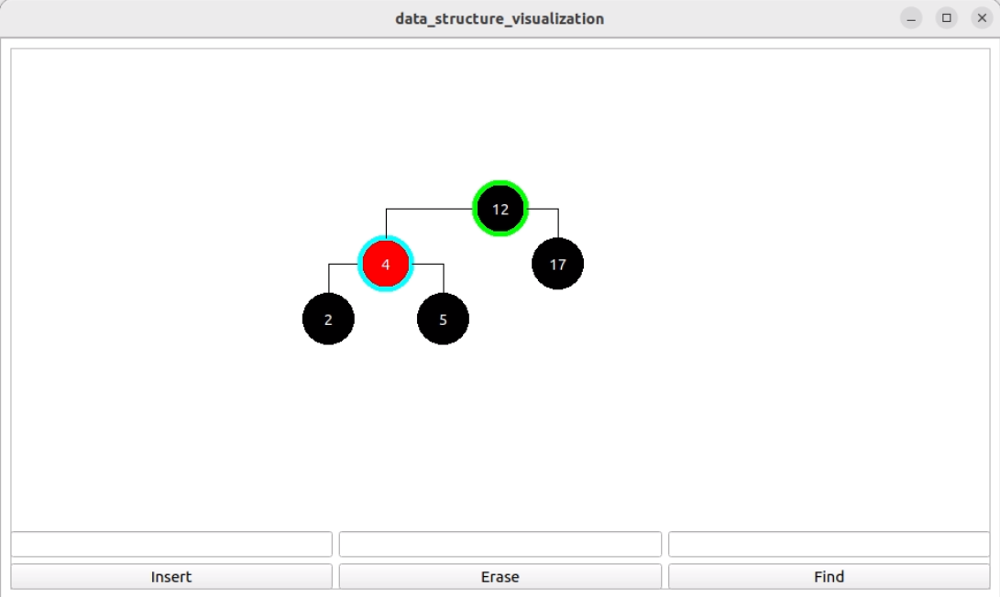
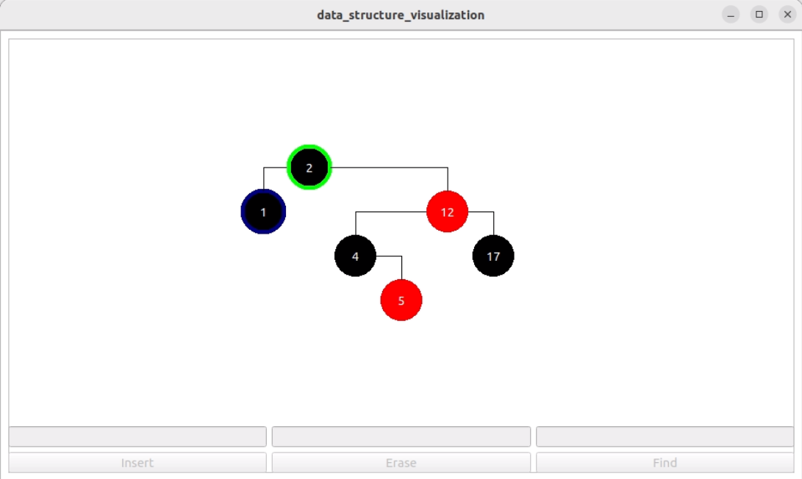
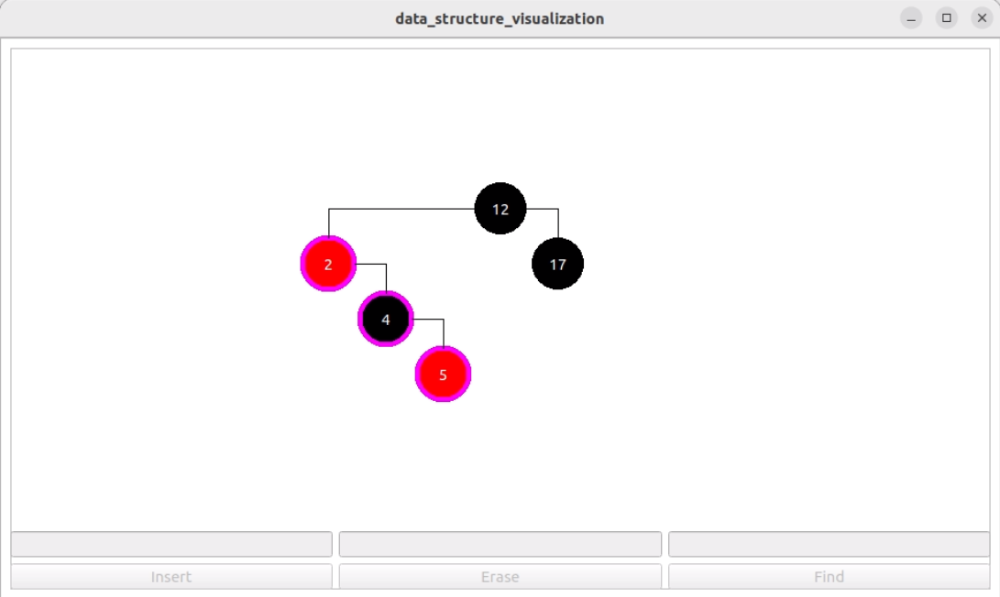
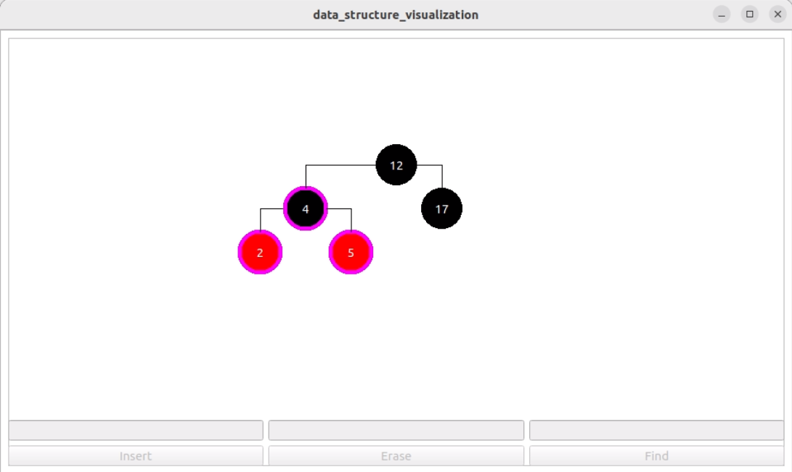

# Визуализация работы красно-черного дерева

Графическое интерактивное приложение, написанное на С++, с помощью Qt

## Требования

* C++20
* GCC 11.3.0
* CMake 3.22
* Qt5

## Сборка

```
mkdir build
cd build
cmake ..
make data_structure_visualization
./data_structure_visualization
```

## Скриншоты

* Найденнная вершина помечается голубым


* Вершина, которую предстоит удалить, помечается синим


* Вершины, участвующие в повороте, помечаются фиолетовым



## Что можно добавить

* Сделать дерево персистентным (позволит его быстро копировать, а также легко добавить просмотр истории изменений)
* Сделать отрисовку неблокирующей (на данный момент невозможно послать очередный запрос, пока не отобразилась вся анимация)
* Добавить возможность сохранять и загружать дерево
* Позволить пользователю выставлять произвольное время анимации
* Добавить визуализацию работы итератора на данном дереве
* Позволить пользователю удалять вершины, нажатием на них
* Избавиться от зависимости от компилятора
